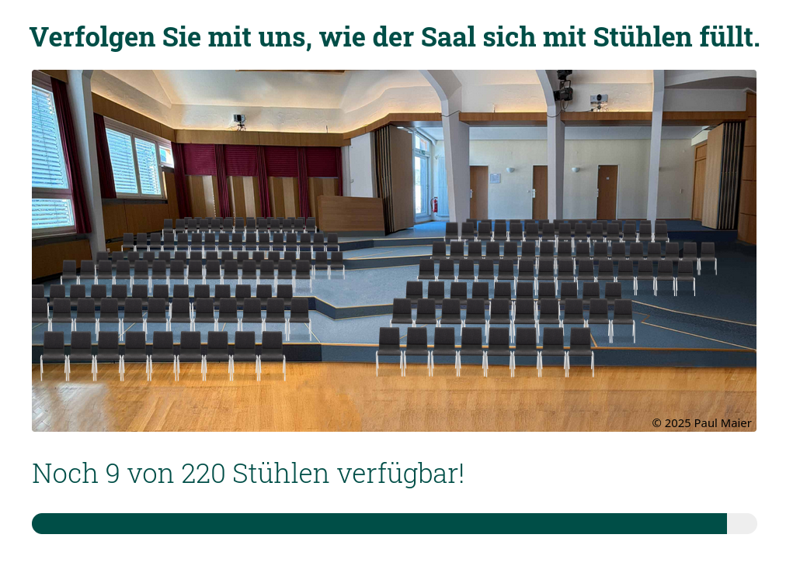

# Birklehof Spendenbarometer

This is a digital donation tracker for new chairs in the Musikhaus of Birklehof.

For more details see https://www.birklehof.de/stuehle/.

## Development

The site is a basic Svelte app which uses the Vercel Edge API as Backend for the chair count.

```bash
npm run dev
npm run lint -- --fix
```

## Deployment

The page is deployed on Vercel and embedded on the wordpress under https://www.birklehof.de/stuehle/

```html
<!-- #TODO add WP code -->
```

